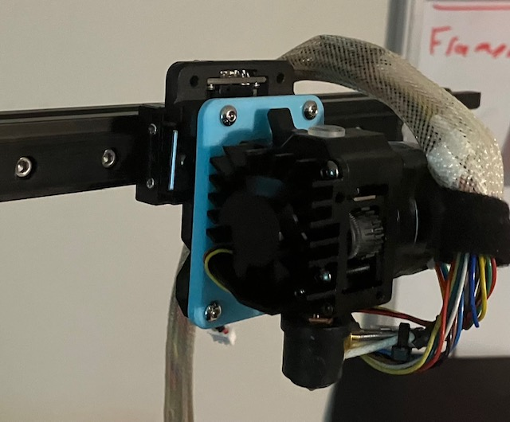

# Bracket for Smart Orbiter 3 Direct Drive Extruder to Voron Tap

This repository contains files for a bracket designed to attach a Smart Orbiter 3 direct drive extruder to a Voron Tap.

## Files

- `bracket.FCStd`: FreeCAD file for the bracket design.
- `bracket-Body-smart-orbiter3-to-voron-tap.stl`: STL file for 3D printing the bracket.
- `bracket-Body-smart-orbiter3-to-voron-tap.scad`: SCAD file for the bracket design.
- `beta-bracket.jpg`: Image of the bracket.

## Preview

## Instructions

1. Open `bracket.FCStd` in FreeCAD to view and modify the design.
2. Use `bracket-Body-smart-orbiter3-to-voron-tap.stl` for 3D printing the bracket.
3. Modify the design using `bracket-Body-smart-orbiter3-to-voron-tap.scad` if needed.

